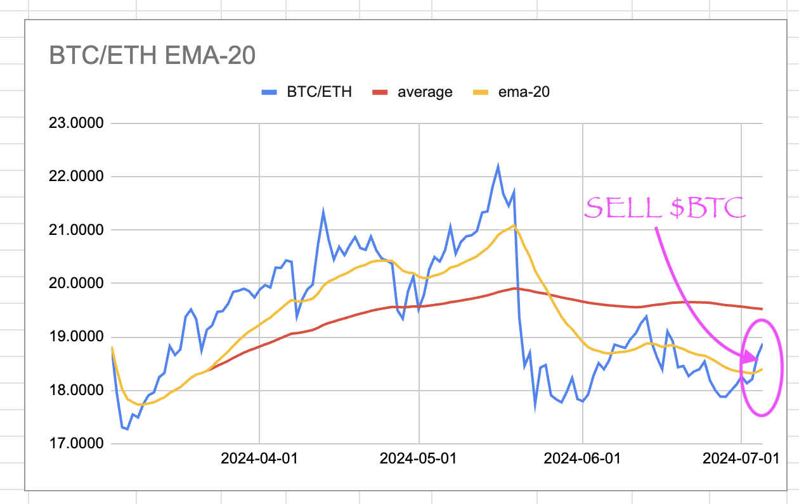
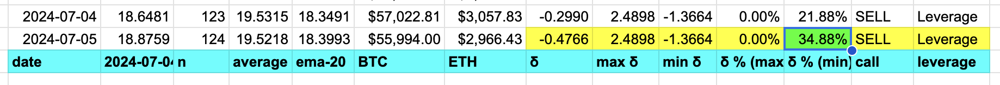

# Pivot quiz 14: EMA20-vs-ratio δs

## "δ Dawn, what's that flower you've got on?"

The previous quiz gave us buy/sell-calls, but that was it. It didn't tell how
strong the recommendation was, and, in consequence, how much to sink into the
trade.

"How do we, then, arrive at the strength of a recommendation?" you ask.

Glad you asked.

## EMA20-vs-ratio δs

The way I arrive at the strength of a recommendation is to compute the δs
between the EMA20 and the ratio for that date. That, in context, doesn't get
us anything (because: how do we determine if today's δ is a large one or a 
small one?), but taking all the δs for a period does.

When you compute all the δs for a period, then ratio today's δ to the max δ
(or min δ, if negative), then you arrive at the strength of the δ as a 
percentage. You can then use that number as a basis to determine how much to
commit to the trade.

## computing δs, min δ, max δ, δ-percentage

We're not doing trades today, nor are we calculating the amount to commit.

Today we're computing the δs for a period, then computing the δ-percentage 
today, based off of either the max δ or the min δ.
