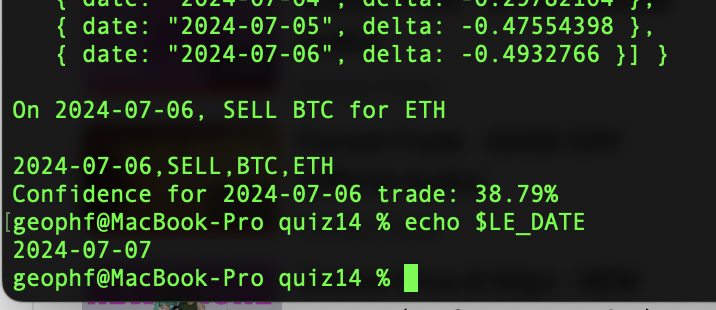

# Pivot quiz 14 answer: δ-confidence.

Computing the δs became reductive once I 
[created a type](https://github.com/logicalgraphs/crypto-n-rust/blob/main/src/pivot/swerve/types.rs#L218-L266)
that computed themselves from the EMA20s-vs-ratios: 

With that, all I needed was the min, the max, and from that I have today's 
δ-confidence. 

