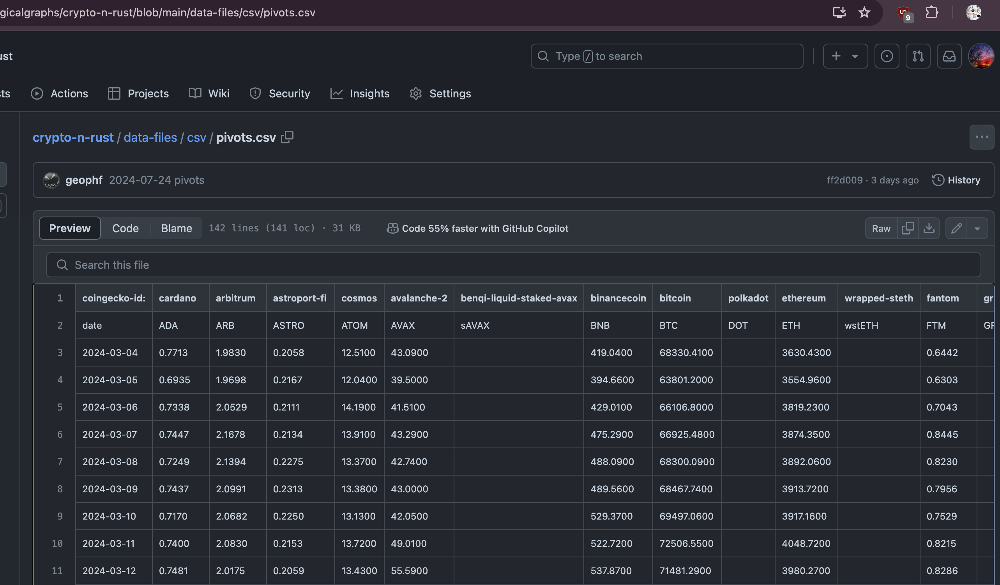

# Pivot quiz 16

## Computing number of days data is missing from `$QUOTES`

Given (today's) date, read $QUOTES, fetch the maximum date and compute how 
many days of data we're missing.

Reminder that 
[$QUOTES](../../data-files/csv/quotes.csv) 
is my 'database' of token-prices (upon which I compute pivot-arbitrage).

And all [my quizzes](../quizzes) are in my git repository.

DOiT! TOiT!

* ([answer](answer.md))
