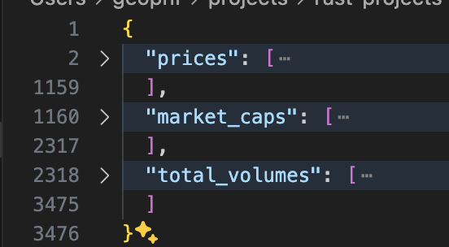
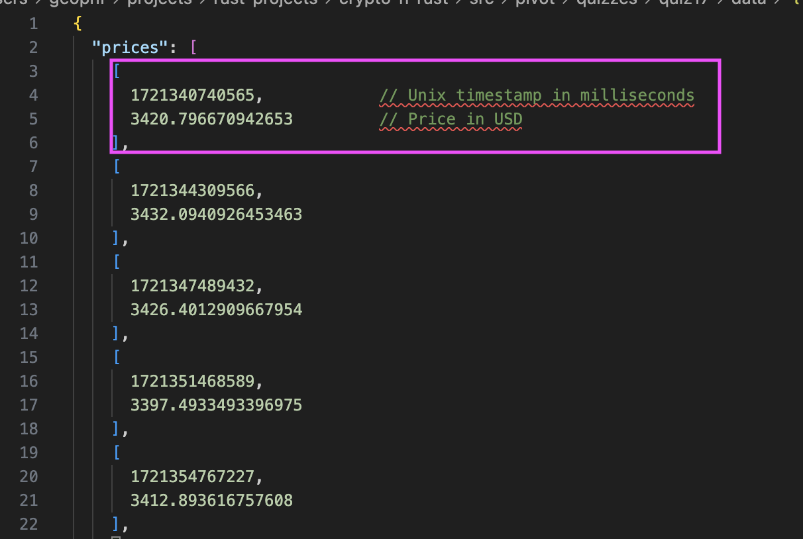
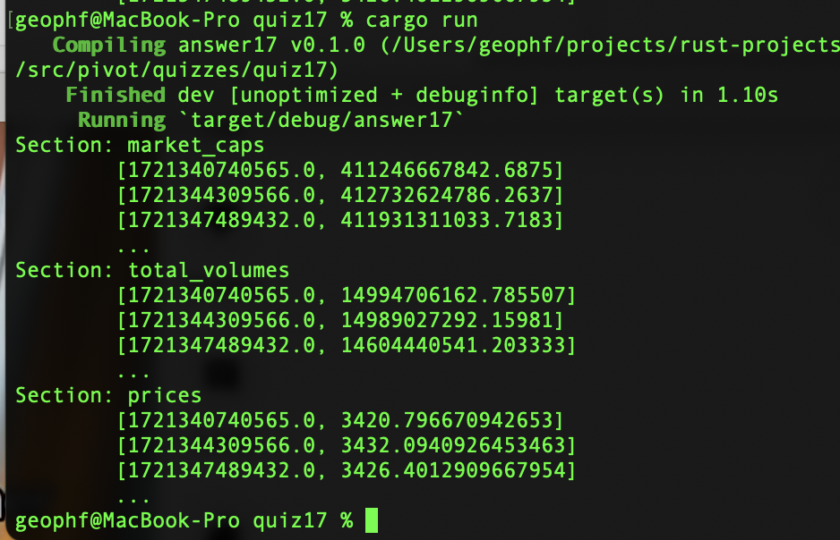
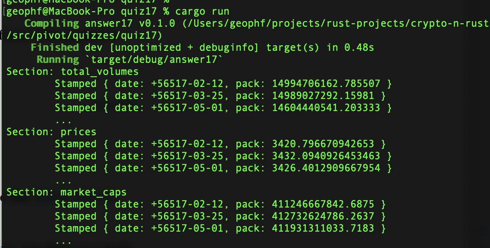
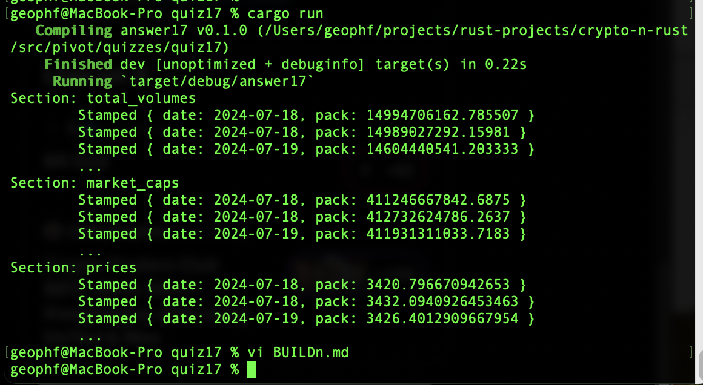
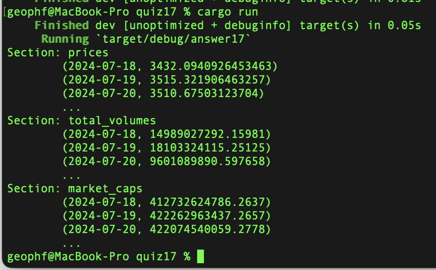

# HOWTO BUIDL `lizard`

Okay, let's solve this problem.

The problem has a couple of domains. One is to fetch the data from the 
@coingecko REST endpoint. The other to process the fetched data.

Let's separate concerns.

Focusing on processing, I download a sample [data-set](data/eth.json).

Let's examine the structure of the JSON.

The response comes with prices, market caps, and volumes.



I'm concentrating on the prices.

Gracious! what a mess!

Prices come stamped with a (bigint) timestamp, but are these values labeled at 
all?



Of course not! They're in a LIST?!??

Data structures 101: don't do this --^

or:

Label each datum, that is: don't use a list index to TYPE YOUR DATA?

e.g.:

```JSON
"prices": [
 { "quote": { "usd": 3420.796671 },
    "stamp": 1721340740565
 }, ...]
```

The reason why JSON exists is for an uniform SELF-DESCRIBING data-exchange.

If you're not going to use JSON for its intended purpose, then pass the data 
back as CSV, ... WHICH IS STILL SELF-DESCRIBING WHEN YOU INCLUDE THE HEADER-ROW!

Why are we still permitting children, who want to save three bytes, so end up 
ADDING WORK, be allowed anywhere near ICDs?

All righty, then. We have what we have. How do we approach solving this problem?

Two common approaches.

1. top-down: we ingest everything, then refine
2. bottom-up: we make one element work, then take on more and more until 
everything's ingested.

I'm going with top-down.

First thing we need to do, top-down, is to ingest the JSON from file to see 
that we have the sections as Rust-values.

Fortunately, we have 
[an example that gets us most of the way there](https://docs.rs/serde_json/latest/serde_json/de/fn.from_reader.html)

Let's implement this and see what we get.

... _implement, implement, implement_ ...

What we get is this:



You see, top-down approach, that my data-structure in
[this first solution that simply reads the JSON and parses the results
into sections](answer17a_sections.rs) is simple:

```Rust
type StampedData = Vec<Vec<f64>>;
type Chart = HashMap<String, StampedData>;
```

Simply a `HashMap` with a `Vec<Vec<f64>>` as values to each section-key.

A simple result, so now let's refine that result until we have workable
data-sets.

## Refinement: Timestamp

The first thing we do in our refinement is a very simple substitution.

We replace the `Vec<f64>` in

```Rust
type StampedData = Vec<Vec<f64>>;
```

with

```Rust
type StampedPrice = Vec<f64>;
type StampedData = Vec<StampedPrice>;
```

This replacement gives us functionally-equivalent code, but allows us to 
refine what a `StampedPrice` is without disturbing enclosing structures.

### The `Deserializer`-problem

Now, this is all well and good if the refinement led to an iterative and 
modular improvement in code leading to an iterative and modular refinement of 
the data.

But then there's 
[the `Deserializer`-documentation](https://serde.rs/impl-deserialize.html)

Hm.

Let's rethink this.

Fortunately for me...

_I'm old._

This means that I've dealt with these kinds of problems before.

The problem: sh!tty data-representation leads to nigh-impossible 
data-transformation solutions if you follow convention.

The solution: transform-by-default THEN transform from that.

This, in no way, absolves the data-provider from being a complete sh!t.

How do you know you're making life hard for people downstream?

Take an outsider-view: 

* Are there unlabeled elements? 
* Are there composite elements that must be separated? 
* Are there strings requiring a custom parser?

JSON and CSV are transporters of atomic, labeled, and parsed data. 
Don't complicate things downstream.

This is data structures 101, folks.

When did software engineers and data scientists forget these fundamentals?

Well: UNforget these fundamentals! Start (re)applying them!

... code, code, code ...

I have a solution that converts the array of numbers (???) in the @coingecko 
JSON response to a `Stamped<Price>`

The problem is that `Stamp`. 



It appears we are in the Year of our Lord 56,000???

They stamp by milliseconds, come to find.

With a slight adjustment to the [solution (dividing the stamp by 1000.0 to
readjust to seconds)](answer17b_timestamp.rs#L33), we now have timestamped 
prices for a token in our pivot-table.




The solution does show us something "interesting."

The chart includes the current price along with all midnight prices, including 
today's.

I'll need to pop the first value to eliminate redundant prices for today in my 
analyses.

Upshot: always do a sanity-check of the results.

## Refinement: eliminate redundant data by date

Okay, next, we wish to clean redundantly-recorded data (by date). Let's do that.

The fix to remove redundancies is a simple rebranding of types. We are indexing
the prices by dates, so: let's just hash the indices, and that auto(magic)ally
removes the redundancies.



Now, hashed dates aren't sorted by date (or: that sorting is not guaranteed),
so there's a wee bit o' complication in extracting the results to display,
both in curtailing the results and by showing those results, sorted by
ascending date.

That wee bit o' complication is easily, if I may say so: sorted.
