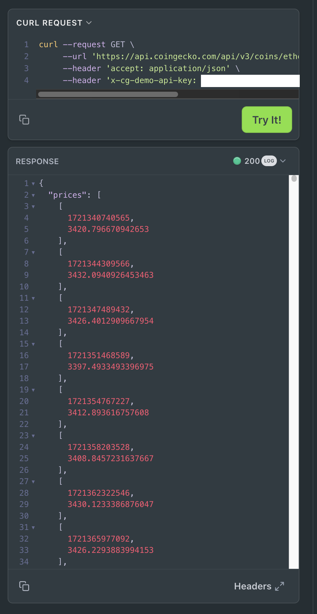
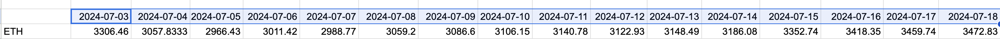

Okay, I now know [how many 'rows' I need to fetch](../quiz16). The next step 
is to fetch these rows, token-by-token.

# Pivot pop-quiz

Programmatically select just one token archived in $PIVOTS, fetch from 
@coingecko the number of rows needed, then output the result as a 
date/token-row.

* We explore and develop the solution to this quiz [here](BUILDn.md).
