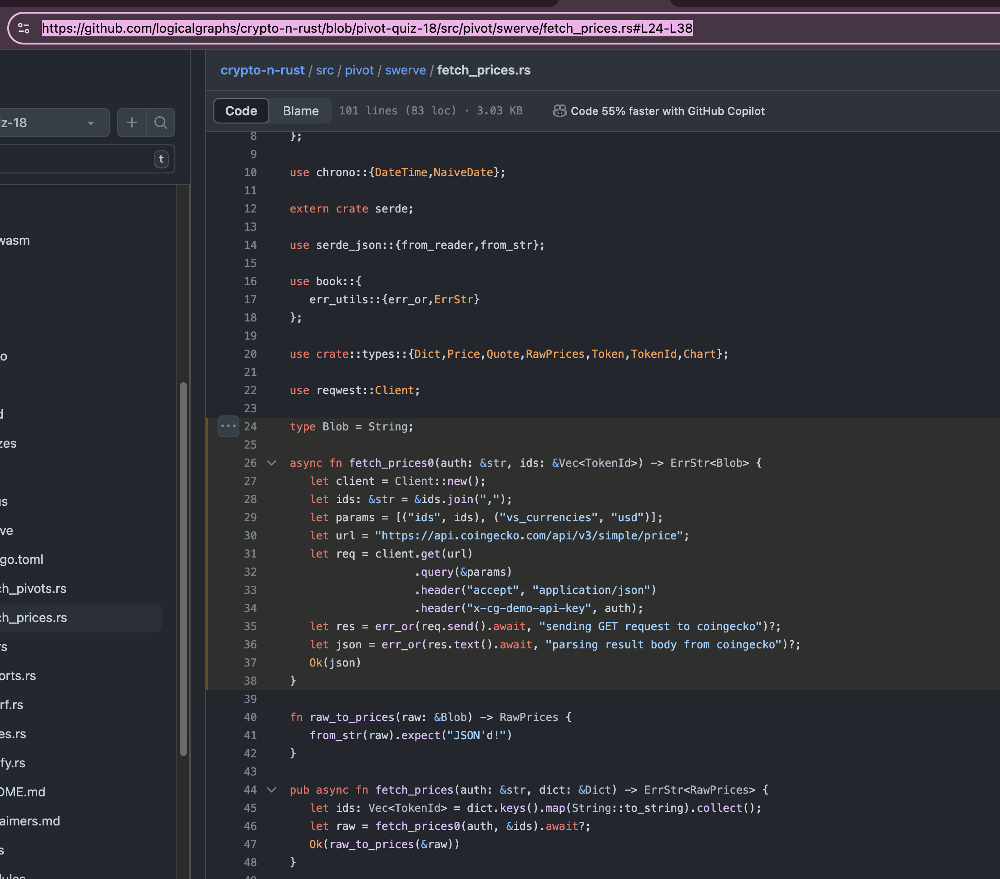
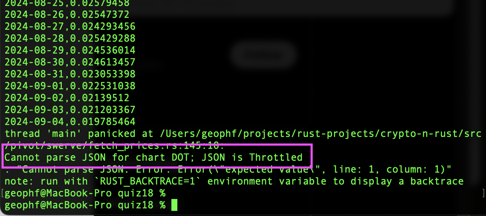

# Pivot quiz 18: `lizard`

In [the previous quiz](../quiz17) we built our solution using a top-down
approach. In this quiz, we'll take the bottom-up approach.

To recap:

* **top-down** builds the entire structure first (the 'skeleton') with no 
functionality. So you have your entire system in place, just that there's no
implementation. You then fill in the implementation, bit-by-bit, going from
working (shell) application to (more) working application.

* **bottom-up** builds each piece, first, then stitches the working pieces 
together at the end to realize the application entire.

I *chose* top-down for [quiz 17](../quiz17) because I knew the (entire)
structure, and the puzzle for me was to refine that structure iteratively
to round-out the data ingested.

I *choose* bottom-up for this quiz because I know, generally, that I'll
need to stitch working functionality, but the problem present to me is the
implementation of that functionality.

*top-down* vs. *bottom-up* is nuanced, but, when 'the right one'&trade;
is used appropriately to solve the problem at hand, the work flows.

So, following the bottom-up approach, the first thing we want to do, I believe, 
is to fetch, well, something! from the chart @coingecko REST endpoint for an 
asset over some days.

`swerve::fetch_prices` module has something close to that, so: let's use that 
as a starting point.

Specifically, I'm speaking about using the 
[fetch_prices0() function](../../swerve/fetch_prices.rs#L24-L38) in the
swerve::fetch_prices module.

Let's create a function from that which takes a token, a number of days, the 
metadata, returning JSON from @coingecko, which we'll reify later.

## Solution

So:

1. fetch the chart for an asset from @coingecko REST endpoint? 
[Done!](answer18a_read_json.rs) ✅

This involved fleshing out the pivot-table-handling in the libraries. Nothing 
major: just a complete top-to-bottom rewrite of everything. 🙄

This answer fetched the first entry in our pivot-(hashed)-dictionary: $sAVAX.

Recall that we are doing the bottom-up approach to coding this solution, so we 
only got the JSON-as-String from the @coingecko REST endpoint. Processing and 
tabling the result comes later.

## Pivot quiz 18.b: reifying the JSON response

...that last part was 18.1.a, don't you know: bottom-up development do be like 
that.

Reify the above JSON string response from @coingecko into appropriate 
#Rust-structures, 
[as we did before](../quiz17).

### Partial answer.

We do reify the JSON into a chart, but it's more than we need, as I'm only 
looking for the prices at present.

One more step to reify to a symbol's price-chart, but what we have here is a 
[good step forward](../../swerve/snarf.rs#L79-L85).

### Pivot Table

Using the work we did in [quiz 17](../quiz17), we convert the chart-data
from @coingecko to a `PivotTable`.

We do this by adding a 
[`swerve::snarf::snarf_pivot_table()`](../../swerve/snarf.rs#L88-L96)-function.

## Pivot quiz 18.c: iterate

Going forward we need to:

1. grab all the $PIVOT asset charts
2. merge those results into the BIG-OL' pivot-table.

The first one is easy enough. The second one can be shunted OFT! into its own 
quizzy-whizzy. Let's start with the first one, then.

## Pivot quiz 18.d: throttling REST endpoint calls

OOPHDA! I thought the quiz was going to be replacing a call to `first()` 
(-...equivalent) with a `for`-loop.

It was, ... until I got a JSON parse error.

Digging deeper, come to find @coingecko throttles the number of calls to their 
REST endpoint on the free-tier, as they should.

Pop-quiz: FIX THIS!
