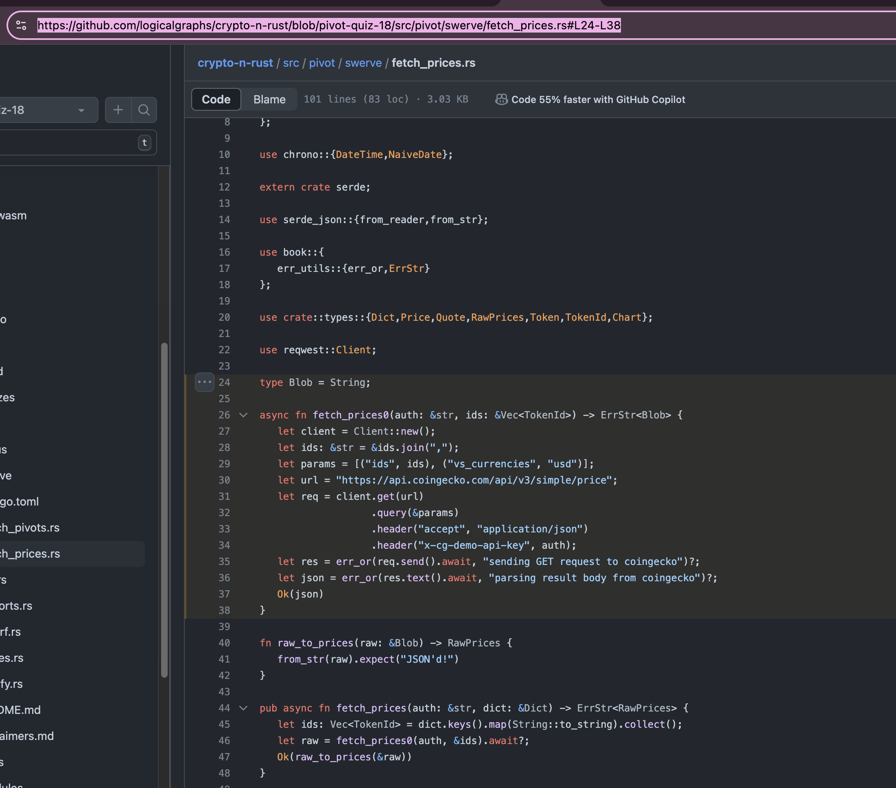

# Pivot quiz 18: `lizard`

In [the previous quiz](../quiz17) we built our solution using a top-down
approach. In this quiz, we'll take the bottom-up approach.

To recap:

* **top-down** builds the entire structure first (the 'skeleton') with no 
functionality. So you have your entire system in place, just that there's no
implementation. You then fill in the implementation, bit-by-bit, going from
working (shell) application to (more) working application.

* **bottom-up** builds each piece, first, then stitches the working pieces 
together at the end to realize the application entire.

I *chose* top-down for [quiz 17](../quiz17) because I new the (entire)
structure, and the puzzle for me was to refine that structure iteratively
to round-out the data ingested.

I *choose* bottom-up for this quiz because I know, generally, that I'll
need to stitch working functionality, but the problem present to me is the
implementation of that functionality.

*top-down* vs. *bottom-up* is nuanced, but, when 'the right one'&trade;
is used appropriately to solve the problem at hand, the work flows.

So, following the bottom-up approach, the first thing we want to do, I believe, 
is to fetch, well, something! from the chart @coingecko REST endpoint for an 
asset over some days.

`swerve::fetch_prices` module has something close to that, so: let's use that 
as a starting point.

