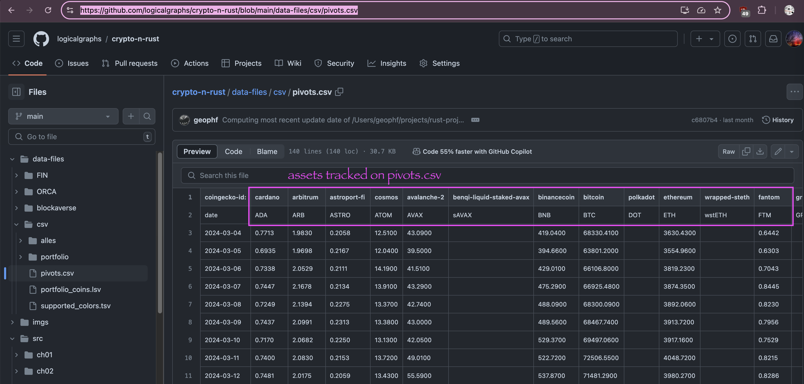

#Pivot quiz 18

OKAY! We're consuming JSON, ... only as a sample data-set.

Let's do two things from here.

1. read the JSON from the @coingecko REST endpoint
   a. request a token's chart from @coingecko REST endpoint
   b. reify the JSON response
2. read not just, say, $ETH's chart, but all the assets in the pivot-table. 

* Our [answer](BUIDLn.md) as a process.
