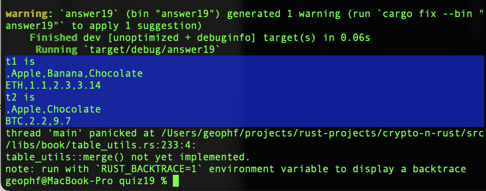

# Pivot quiz 19

## Merge `Table`s solution

How to solve this?

Let's take a piecewise-approach, from the top-down.

The first thing is we need a pair of tables (to merge) and we need a 
`merge()`-function, so let's do that, implementing them with ... get this: 
`panic!()` !?!??!??

Yup, just like in the old Smalltalk days. 😎

What does implementing functionality with `panic!()` do for me?

In Rust, getting the types is important, and, once you've got the types 
declared correctly, then the implementation usually follows in lock-step.

Even though my implementation is currently 'no implementation' with panic!(), 
the program compiles, meaning that the types are correctly declared.

This, in itself, is a big step forward in Rust program development.

Okay, so, let's take the first implementation step.

Fortunately, this is super-easy, because `map_table()` in my program is already 
implemented as 
[`table_utils::from_map()`](../../libs/book/table_utils.rs#L105-L114).

How do I know this? The type-signatures for both are the same.

EASY-PEASIES!

We can now run the program and start to see some things, like: the tables to 
be merged. We also see that table_utils::merge(), itself, is not implemented 
because the `panic!()` tells us so.

`panic!()`-calls are 'holes' in the program that we 'fill' (implement) as we 
go along.
