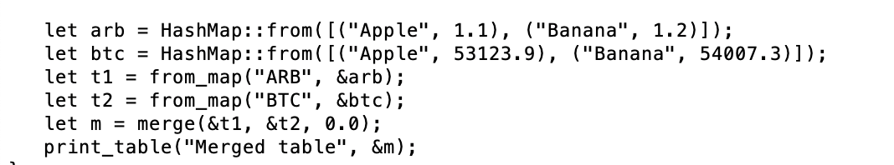

# Pivot quiz 19

## Merge `Table`s solution

How to solve this?

Let's take a piecewise-approach, from the top-down.

### `panic!()` as implementation-*'holes'*

The first thing is we need a pair of tables (to merge) and we need a 
`merge()`-function, so let's do that, implementing them with ... get this: 
`panic!()` !?!??!??

Yup, just like in the old Smalltalk days. 😎

What does implementing functionality with `panic!()` do for me?

In Rust, getting the types is important, and, once you've got the types 
declared correctly, then the implementation usually follows in lock-step.

Even though my implementation is currently 'no implementation' with panic!(), 
the program compiles, meaning that the types are correctly declared.

This, in itself, is a big step forward in Rust program development.

### implementing `map_table()`

Okay, so, let's take the first implementation step.

Fortunately, this is super-easy, because `map_table()` in my program is already 
implemented as 
[`table_utils::from_map()`](../../libs/book/table_utils.rs#L105-L114).

How do I know this? The type-signatures for both are the same.

EASY-PEASIES!

We can now run the program and start to see some things, like: the tables to 
be merged. We also see that table_utils::merge(), itself, is not implemented 
because the `panic!()` tells us so.

`panic!()`-calls are 'holes' in the program that we 'fill' (implement) as we 
go along.

### implementing `table_utils::merge()`

So, the next 'hole' to implement is `table_utils::merge()`, itself.

It's a big one, so let's address this problem, piecemeal.

First, we want to merge the table-headers, both for rows and columns.

Pretty interesting problem, as each table has its own indexing by row and 
column.

That's a rather big-ol' implementation, but that gives us the structure for 
the new merged table, as we see in a new program-run.

At the end of the day, a table-merge devolved into 
[two for-loops](../../book/table_utils.rs#L244-L281), iterating 
over the rows of the merged tables, then, in each row, iterating over the 
columns in those rows.

A really simple idea, once explained in this fashion. ✅😅 

All the above was a ... *'simple' (?)* test-case, showing that we could
merge two tables. Now we need to merge the big-honkin' results from the
coingecko charts-query to answer Pivot quiz 19.

## The need for testing

Okay, BUT HOLD UP!

My implementation, earlier, used a bijection, then I dropped it (???).

That didn't sit well with me.

So I ran a test.

Yup. I needed that bijection for a proper `Table`-merge to retain the 
old-table indices.

Let's fix the issues `table_utils::merge()`.

### re-added bijection

Reintroducing bijection from the old tables to the newly merged table properly 
frames the merged-data.

Let's now proceed with merging the @coingecko chart-data into $PIVOTS.

### ... one more thing: merge()-as-Result

ONE more thing before proceeding.

I implemented `merge()` with a `default`-argument for when I couldn't lookup 
values during the merge.

There are very serious times I'd rather fail, so now I allow defaults or throw 
an `Err` when I don't want defaulting-behavior on merge.

### ... aaaannnnnnddd the merge

TA-DA! New functionality: bulk-loading of token charts from @coingecko, DONE! ✅

Just one tweak: I have to tune alphabetizing by token-type (the circled 
assets), but we GOT'r DONE! 

So, a ... 'little' measurement. That's 46 days * 38 assets-worth of prices I 
just bulk-loaded, or 1748 data-points.

Automation. Me likey! 😎
