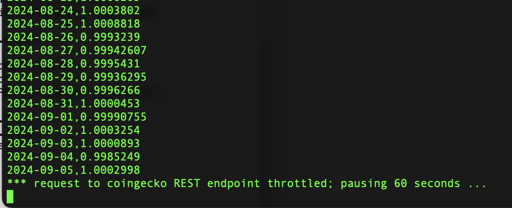
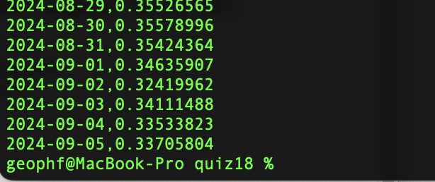

# Pivot pop-quiz 19: merge tables

We've collected the results for all the tokens in $PIVOTS, ...

... but they are separate.

We need to coalesce the results into one big-ol' honk'n $PIVOT table result, 
so we can add these results to our data-store.

One way to do that: write `table_utils::merge_tables()`

* Follow along as we [BUIDL our solution](BUIDLn.md).
