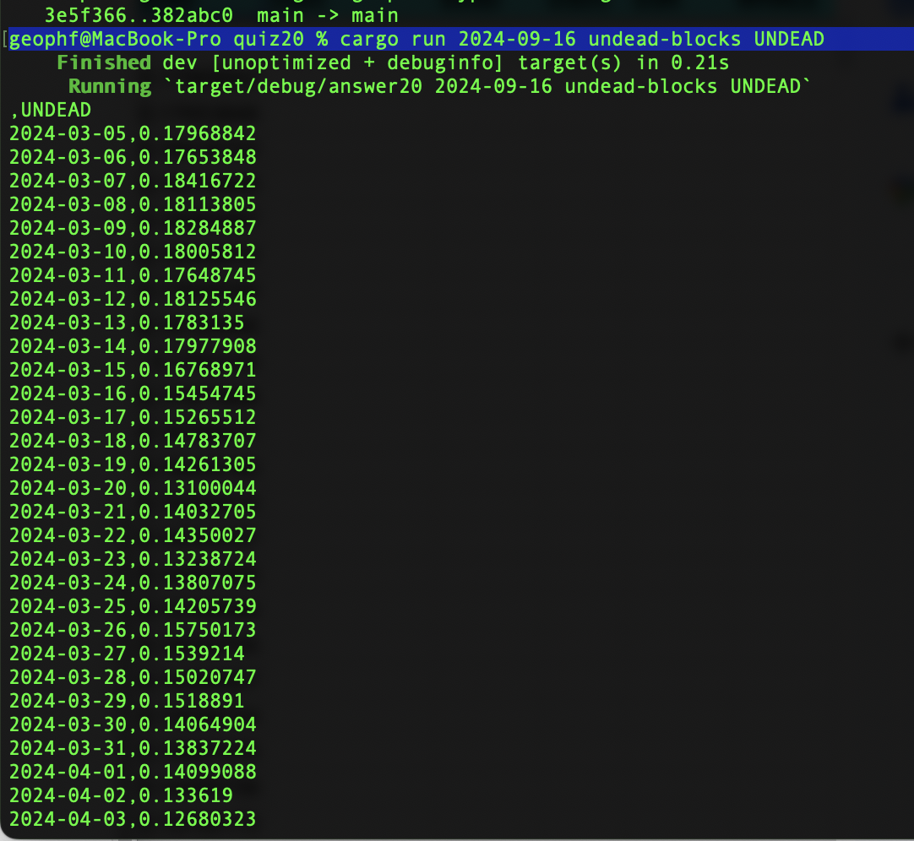

# Pivot quiz 20 answer

## fetching an individual token-chart from @coingecko

Not really much to this answer as all the infrastructure (the 'pipe') has
already been laid. Just a simple call to `snarf_pivot_table()` from our
[`main()`](answer20.rs#L37) does the trick.

