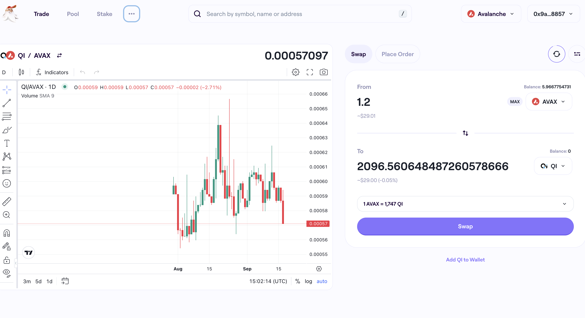

# Pivot quiz 21: `./dawn`

## Compute trade-amounts

We have [`./rekt`](../../dApps/rekt), which renders a buy/sell-call on 2 
tokens with a confidence-measure, δ.

That's ... 'great' (?) but how much do we trade?

Pivot quiz 21: `./dawn` (as in: "🎵 Delta Dawn, what that flower you've got 
on?🎶")

Given the call, δ and blockchain, `./dawn` will look up the amounts of each 
token you have and compute the amount to trade and what you'll get from that 
trade.

```BASH
./dawn SELL AVAX QI 12% avalanche
```

> `Swap 1.2 $AVAX for 2096 $QI`



The lookup can be a wallet dApp or whatever.

* We [BUILD our solution here](BUIDLn.md).
