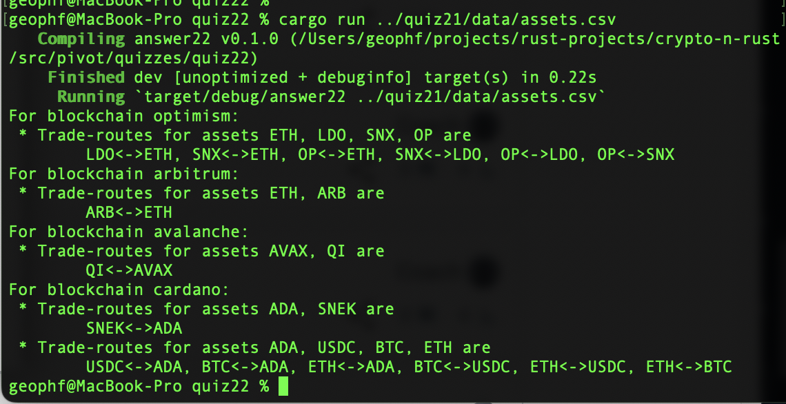
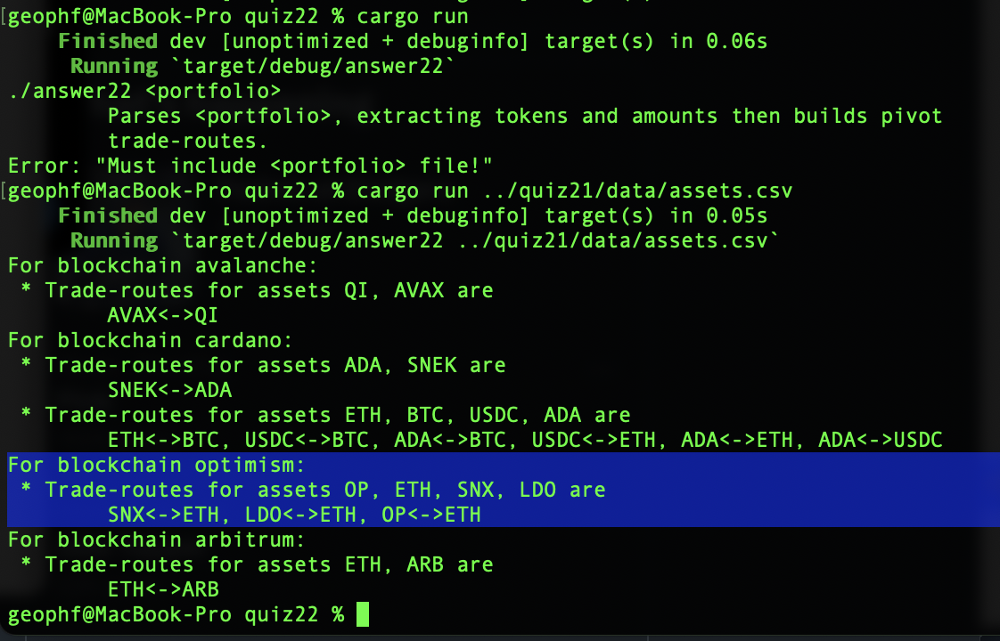

# Pivot quiz 22: answer

## Building trading paths for pivot pools

### First step: not considering prime assets

Without prime assets, then every asset is traded against every other asset.

Or, put simply, this is 
[the powerset of n-choose-2](../../swerve/types.rs#L372-L401).

### Now incorporate prime assets

Now, when we consider primes, [determining the trade-routes becomes more 
complicated](../../swerve/types.rs), but computing them becomes simpler for prime assets: we no longer 
need to take the fix-point of the routing-function. 

