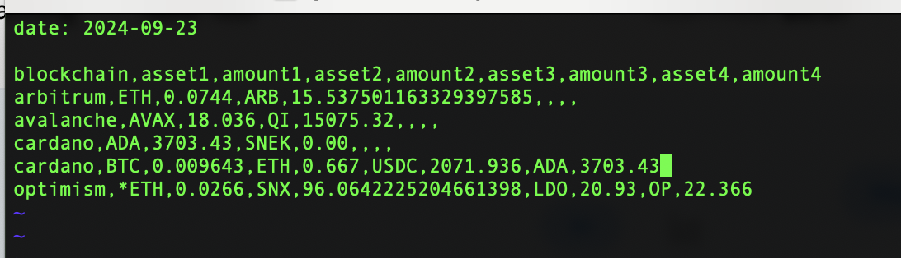

# Pivot pop-quiz 22

## Compute pivot trade-routes

Okay, we can [read available assets across blockchains](../quiz21).

Now, from those read-assets, what are the available pivot trade-routes?

For example, on Avalanche, the pivot trade route is AVAX<->QI

On Optimism, it's much more complicated.

Compute.

* We BUIDL our solution step-by-step [here](BUIDLn.md).
