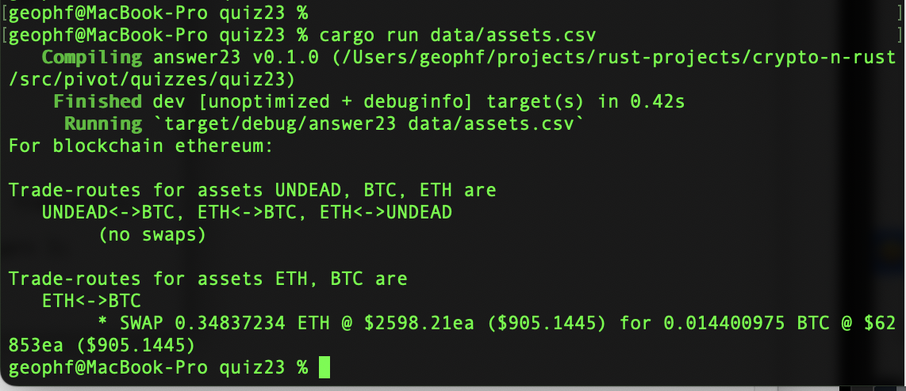

# Pivot quiz 23 answer

## `./dawn`

The solution for `./dawn` involved introducing two new types to the 
`swerve`-library: `PricedAsset` and `TradeCall`.

Then we construct the `TradeCall`-value from the pivot-table data and the
recommendation for today from the `TradeRoute`. We know how much of each
asset available to trade from the `Pools` that we extract from our 
`assets.csv`-file.

