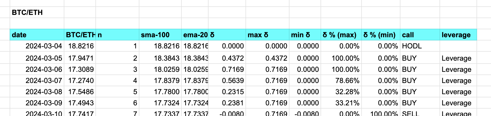

# Pivot quiz 24

## Showing state for debugging

What is happening with ./dawn under the hood to make these recommendations?

Output ./dawn's state for each (non-)recommendation, something like this: 

