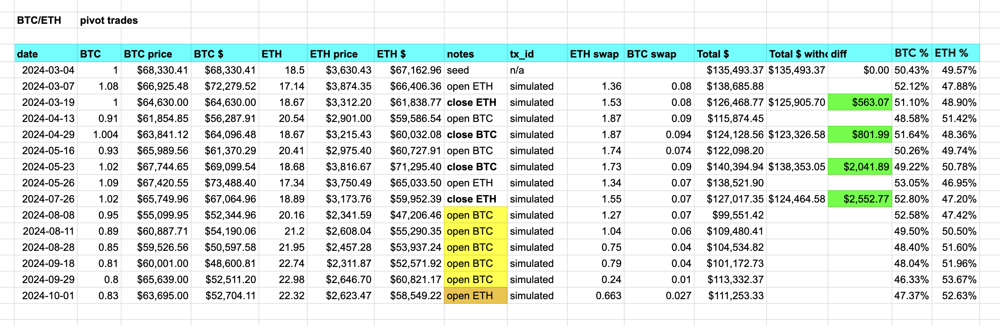

# Pivot quiz 24

## Parsing open positions

Let's BUIDL ./dusk.

First up, parse the open pivot positions, ...

... so we can assess

1. Should we close an open position? or
2. Should we open a new position, given the current open positions (if any)? 
