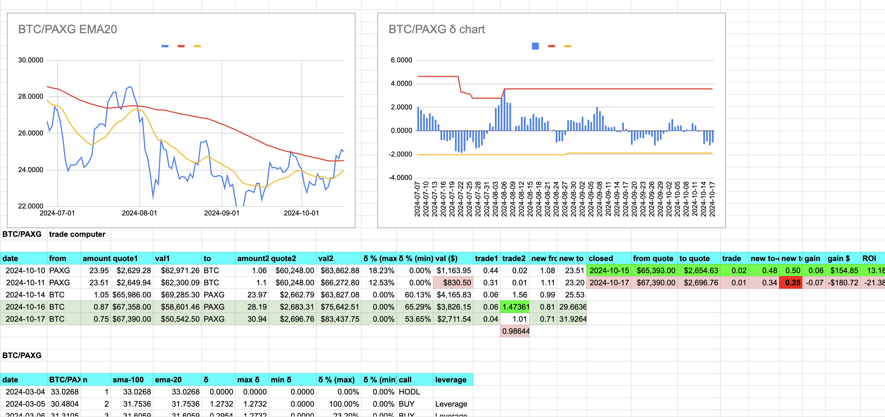

# Pivot quiz 25 answer: dusk

## Pivot anatomy

First, let's start with the anatomy of a pivot.

What is a pivot?

Easy:

* an open pivot trade then the close pivot trade. So: two trades, basically.

Not so easy: 

* well, that's where we get to work, eh? 😎 
